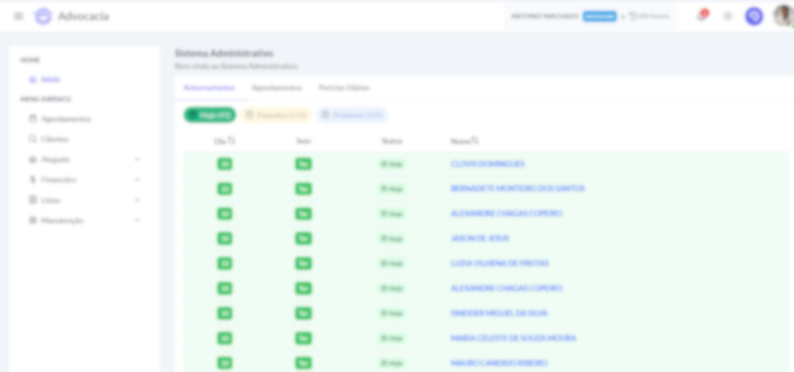
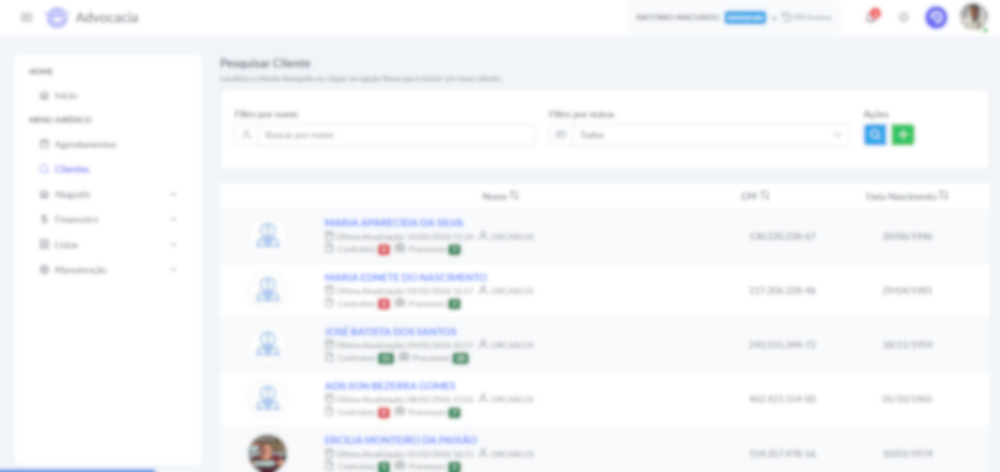
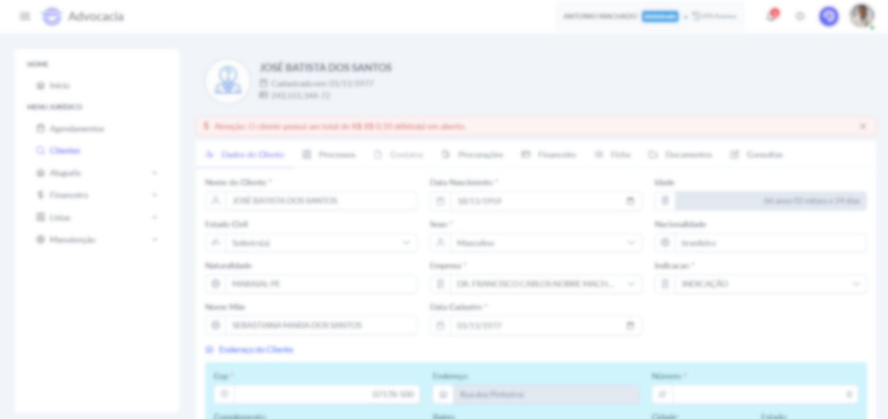
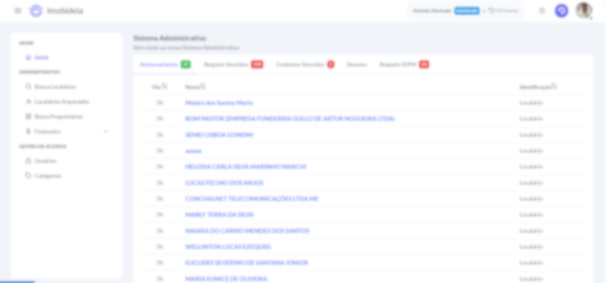
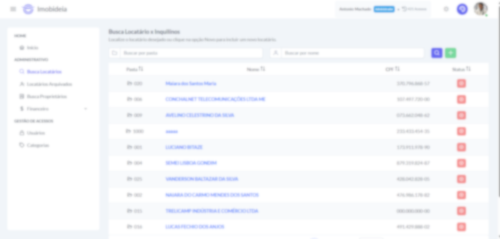
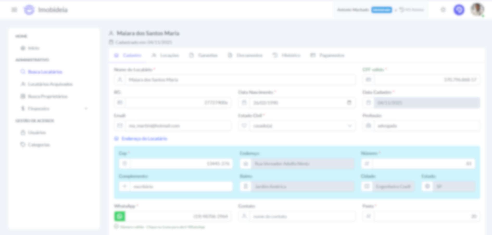
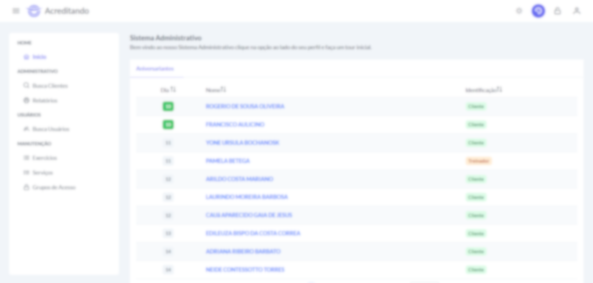
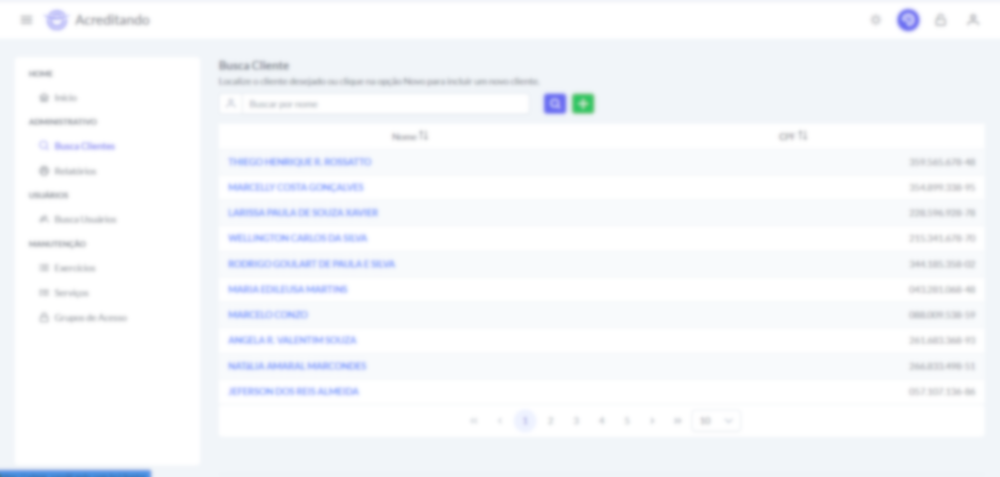
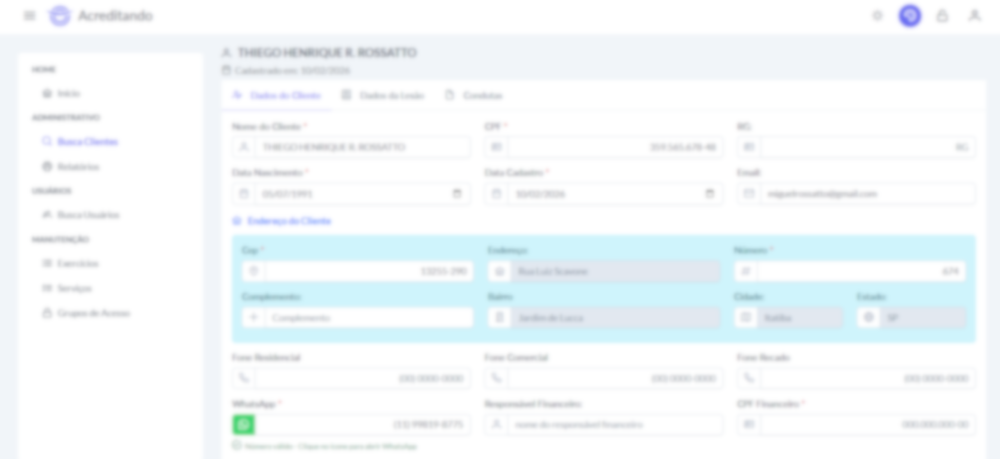

# Projetos Pessoais – Angular 19 + PHP + MariaDB

> ⚠️ **Aviso importante**  
> Este repositório é **exclusivamente documental**, apresentando visão geral, arquitetura e decisões técnicas de projetos pessoais.  
> O código-fonte completo é mantido em **repositórios privados** por questões contratuais e de confidencialidade.

Este repositório reúne documentação de três projetos pessoais desenvolvidos com **Angular 19 (front-end)**, **PHP (back-end)** e **MariaDB (banco de dados)**. Todos utilizam o mesmo layout base (Sakai Free) e arquitetura baseada em **componentização e contratos de API**, garantindo **reuso, manutenção e consistência entre telas**.

---

## 🏛️ Projetos

### 1️⃣ Sistema de Gestão para Escritório de Advocacia

- Gestão de clientes, processos e andamento processual
- Controle financeiro e administração de aluguéis
- Componentes reutilizáveis exibindo os mesmos dados em diferentes telas
- Uso de contratos de API padronizados

**Imagens ilustrativas (dados fictícios / blur):**

#### Dash Inicial

#### Listagem de Clientes

#### Dados, Contratos Processos, Andamentos, Documentos

---

### 2️⃣ Sistema de Gestão Imobiliária

- Controle de contratos de locação e parcelas
- Monitoramento de imóveis alugados e agenda de vencimentos
- Reaproveitamento de componentes e layout do projeto de advocacia

**Imagens ilustrativas (dados fictícios / blur):**

#### Dash Inicial

#### Listagem de Locatários

#### Dados, Contratos, Documentos, Pagamentos e Histórico

---

### 3️⃣ Sistema de Clínica de Fisioterapia

- Controle de pacientes, atendimentos e histórico de condutas
- Registro de condutas realizadas em cada sessão
- Componentes reutilizáveis para exibir dados de pacientes em diferentes telas

**Imagens ilustrativas (dados fictícios / blur):**

#### Dash Inicial

#### Listagem de Clientes

#### Dados, Condutas e Procedimentos

---

## 🧱 Arquitetura e Tecnologias

- **Angular 19 (Front-end)**
  - Componentes reutilizáveis e serviços desacoplados
  - Integração com back-end via contratos de API
  - Layout responsivo baseado em Sakai Free

- **PHP (Back-end)**
  - Implementação de regras de negócio e endpoints padronizados

- **MariaDB (Banco de dados)**
  - Modelagem relacional, integridade e consistência de dados

### Componentização e Contratos

- Componentes Angular recebem dados via `@Input` e emitem eventos via `@Output`
- Mesma informação exibida em múltiplas telas de forma consistente
- Redução de duplicação de código e aumento da manutenibilidade

---

## 🤖 Apoio de IA Generativa

- IA Generativa usada como **suporte**, para sugestões de componentização, validação de contratos de API e revisão de código
- Todas as decisões técnicas foram feitas manualmente e validadas pelo desenvolvedor

---

## 📬 Contato

Para mais informações sobre arquitetura, decisões técnicas ou detalhes dos projetos, entre em contato pelo e-mail: **nobbre@gmail.com**
